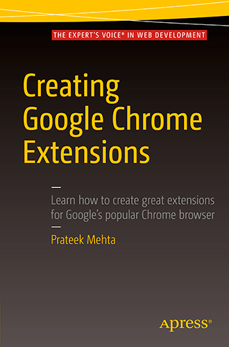

**Creating Google Chrome Extensions** - перевод книги.

---

Реализованно

* Книга переведена с английского на русский язык.

Проделанная работа

* Выполнен перевод книги.
* Сделана редакция книги.
* Выполнен релиз книги.

Использовались технологии / инструменты

* Google Chrome, JavaScript, Markdown, GitBook, GitHub.

Ссылки на ресурсы

* _GitHub_: [https://github.com/Toruse/Creating-Google-Chrome-Extensions](https://github.com/Toruse/Creating-Google-Chrome-Extensions)
* _Содержание книги_: [https://github.com/Toruse/Creating-Google-Chrome-Extensions/blob/master/SUMMARY.md](https://github.com/Toruse/Creating-Google-Chrome-Extensions/blob/master/SUMMARY.md)
